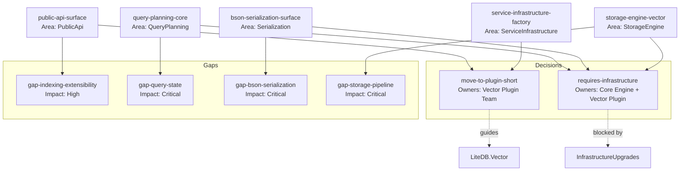

# Component Dependency Diagram

**Legend**

- **Solid arrows** link inventory components to their governing migration decision or blocking gap.
- **Dashed arrows** highlight external dependencies: `LiteDB.Vector` implementation work and the shared infrastructure upgrade stream.
- Critical gaps (G2-G4) must be resolved before components `C3-C5` can migrate; `C1` and `C2` can advance in parallel once plugin shims land.
